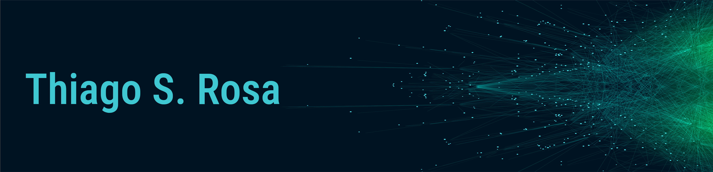

   

  

> ## <a href="https://www.linkedin.com/in/thiagosouzadarosa/">Sobre mim</a>

<marquee style='width: 30%; color: blue;'><b>Welcome!</b></marquee>

Testing......

**Background em:** (em construção)

**Contate-me:** 

* [LinkedIn](https://www.linkedin.com/in/thiagosouzadarosa/)
* [E-mail](thiagosouzadarosa@gmail.com)
* [Instagram](https://www.instagram.com/thiagos.rosa/)

## Projetos: (em construção)
